# SClaw

SClaw 是一个面向本地桌面使用的 AI 助手项目，基于 `ironclaw` 定制，支持浏览器网关访问和飞书机器人接入。

这份文档只保留最常用的内容：

1. 安装依赖
2. 运行项目
3. 打包 macOS 应用

## 1. 安装依赖

### 必需依赖

- macOS
- Xcode Command Line Tools
- [Rust](https://www.rust-lang.org/tools/install)
- `rustup`
- `cargo`
- `wasm-tools`

### 一次性安装命令

如果你的机器是第一次安装 Rust，建议按下面顺序执行：

```bash
# 安装 Rust / rustup
xcode-select --install
curl --proto '=https' --tlsv1.2 -sSf https://sh.rustup.rs | sh
source "$HOME/.cargo/env"

# 安装项目依赖
rustup toolchain install stable
rustup default stable
rustup target add wasm32-wasip2
cargo install wasm-tools
```

安装完成后，可以用下面命令检查是否成功：

```bash
rustc --version
cargo --version
rustup --version
wasm-tools --version
```

### 可选依赖

- Docker Desktop

说明：

- Docker 只在你需要沙盒工具执行时使用。
- 不安装 Docker，SClaw 也可以正常启动和聊天。

### 获取项目代码

```bash
git clone <你的仓库地址>
cd SClaw
```

## 2. 运行项目

### 第一步：编译

```bash
cargo build --release
```

### 第二步：启动

```bash
cargo run
```

启动后，SClaw 会自动打开本地浏览器页面。

## 3. 打包项目

当前 macOS 打包流程使用以下目录：

- `assets/SClaw.app`
  作为空的 app 模板
- `target/release/ironclaw`
  作为编译后的可执行文件
- `target/SClaw.app`
  作为最终生成的 app
- `target/SClaw.dmg`
  作为最终生成的 dmg

### 第一步：编译 release 产物

```bash
cargo build --release
```

### 第二步：执行打包脚本

```bash
bash scripts/package-macos-dmg.sh
```

脚本会自动完成以下操作：

1. 删除旧的 `target/SClaw.app`
2. 删除旧的 `target/SClaw.dmg`
3. 复制 `assets/SClaw.app` 到 `target/SClaw.app`
4. 复制 `target/release/ironclaw` 到 `target/SClaw.app/Contents/MacOS/ironclaw`
5. 生成 `target/SClaw.dmg`

### 打包结果

打包完成后，你会得到：

- `target/SClaw.app`
- `target/SClaw.dmg`

### 上传到 GitHub Release

如果你希望用户在 GitHub 的 Release 页面直接下载安装包，可以使用 `gh` 上传 `target/SClaw.dmg`。

#### 第一步：安装并登录 GitHub CLI

```bash
brew install gh
gh auth login
```

#### 第二步：创建标签并推送

下面以 `v0.1.0` 为例：

```bash
git tag v0.1.0
git push origin main --tags
```

#### 第三步：创建 Release 并上传 dmg

```bash
gh release create v0.1.0 target/SClaw.dmg \
  --title "SClaw v0.1.0" \
  --notes "首个可下载安装版本"
```

如果这个版本号已经存在，只想重新上传安装包，可以执行：

```bash
gh release upload v0.1.0 target/SClaw.dmg --clobber
```

## 说明

- `target/` 目录只存放编译和打包产物，不需要提交到 Git。

## 安装应用

- 下载 SClaw.dmg 到本地，双击打开，把 SClaw 拖到 Applications 文件夹中。

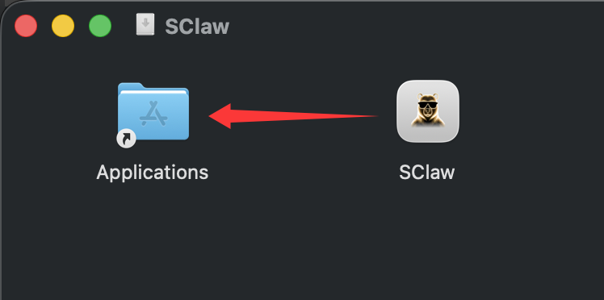

- 如果应用在另一台 macOS 机器上被系统拦截，或提示app无法打开，需要命令行执行权限：

```bash
xattr -dr com.apple.quarantine /Applications/SClaw.app
```

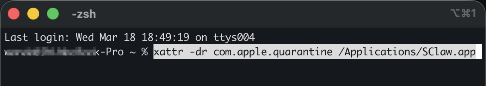

- 应用授权以后再次尝试打开 SClaw.app

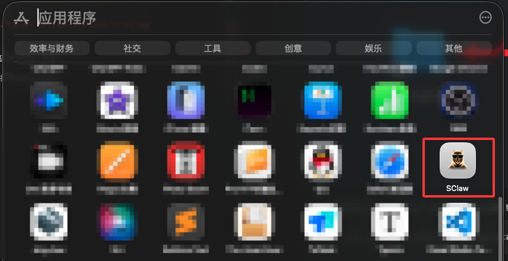

- SClaw.app 启动以后会自动打开弹出浏览器，地址: http://127.0.0.1:3180/

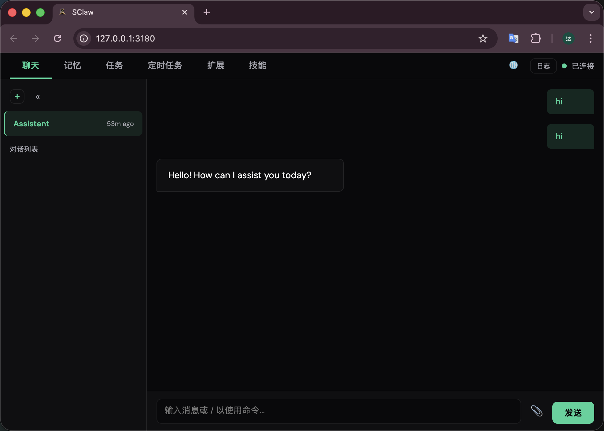

## 对接飞书

- 获取飞书秘钥，打开 [飞书开放平台](https://open.feishu.cn/app?lang=zh-CN)  - 开发者后台 - 创建企业自建应用


- 创建企业自建应用，填写 应用名称、应用描述、应用图标

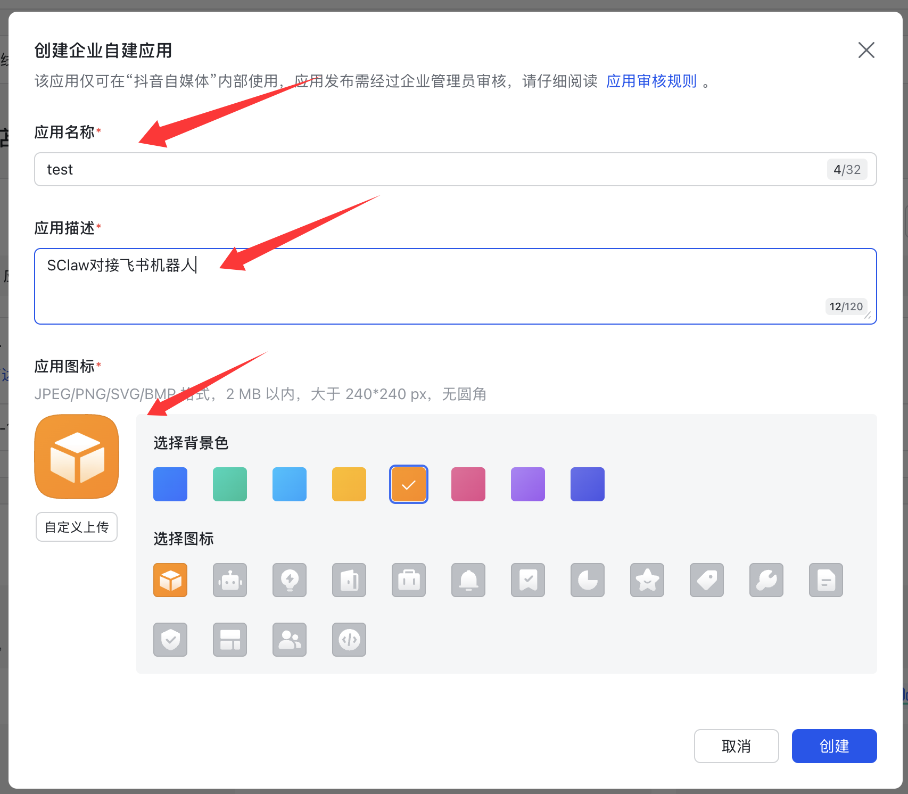

- 获取 App ID 、 App Secret 、 Verification Token，填写到 SClaw - 扩展 - 配置feishu

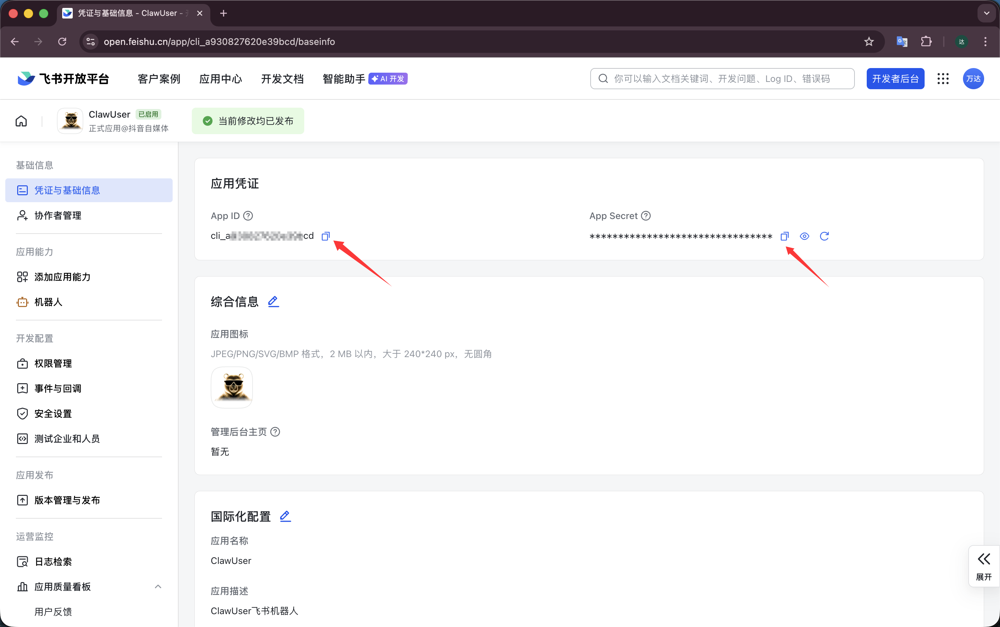

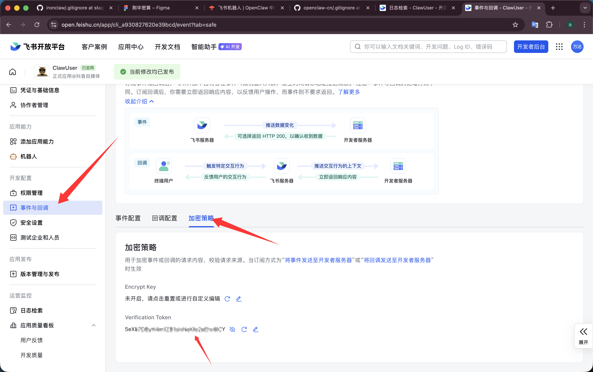

- SClaw 安装扩展 - 飞书

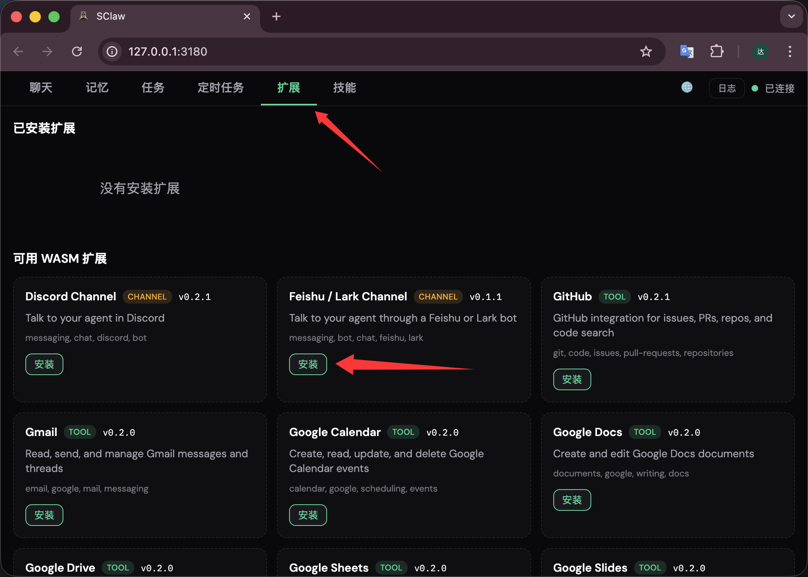

- 配置飞书秘钥 App ID 、 App Secret 、 Verification Token

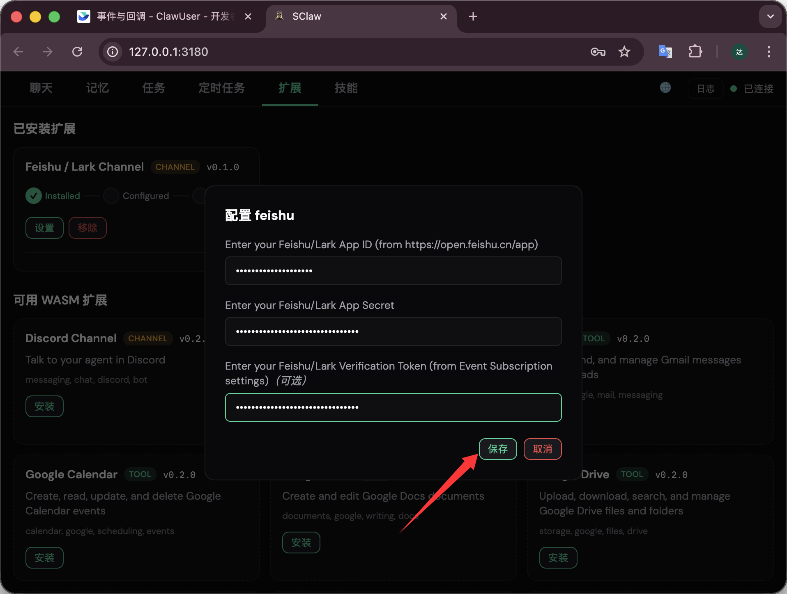

- 等待配对

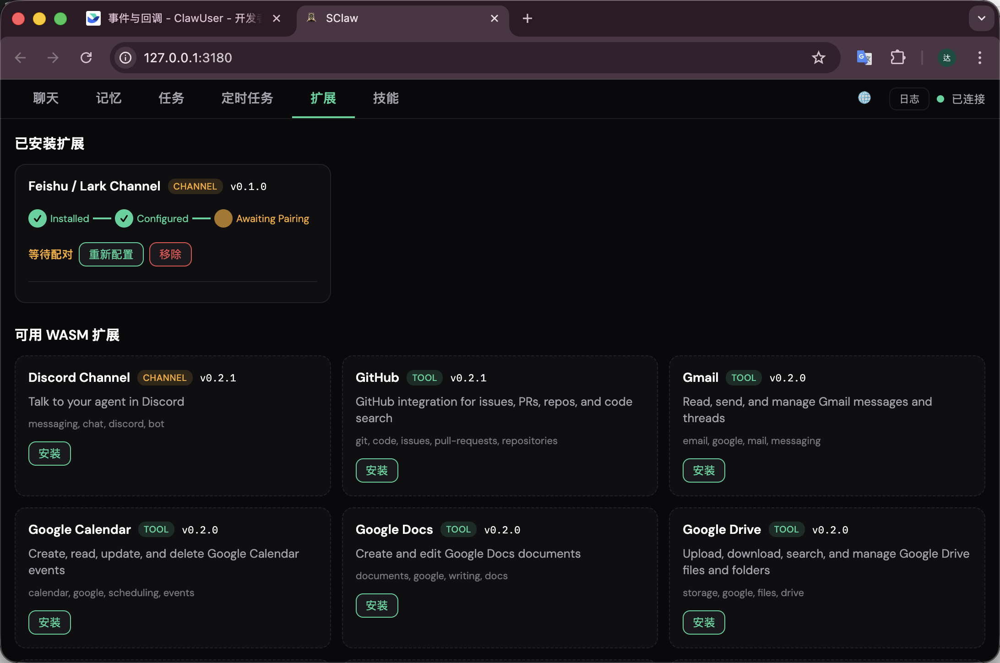

注意：如果配置失败，先移除Feishu扩展，然后强制退出SClaw，重新打开SClaw应用，快速配置 App ID 、 App Secret 、 Verification Token，否则可能会因为长时间未配置导致socket长连接断开而无法连接。

- 配置飞书应用权限

在 权限管理 页面，点击 批量导入 按钮，粘贴以下 JSON 配置一键导入所需权限：
```
{
  "scopes": {
    "tenant": [
      "aily:file:read",
      "aily:file:write",
      "application:application.app_message_stats.overview:readonly",
      "application:application:self_manage",
      "application:bot.menu:write",
      "cardkit:card:write",
      "contact:contact.base:readonly",
      "contact:user.employee_id:readonly",
      "corehr:file:download",
      "docs:document.content:read",
      "event:ip_list",
      "im:chat",
      "im:chat.access_event.bot_p2p_chat:read",
      "im:chat.members:bot_access",
      "im:message",
      "im:message.group_at_msg:readonly",
      "im:message.group_msg",
      "im:message.p2p_msg:readonly",
      "im:message:readonly",
      "im:message:send_as_bot",
      "im:resource",
      "sheets:spreadsheet",
      "wiki:wiki:readonly"
    ],
    "user": ["aily:file:read", "aily:file:write", "im:chat.access_event.bot_p2p_chat:read"]
  }
}
```
注意：im:message.group_msg 权限（获取群组中所有消息，属于敏感权限）允许机器人接收群组中所有消息（不仅仅是 @机器人的）。如果您需要配置 requireMention: false 让机器人无需 @ 也能响应，则必须添加此权限。

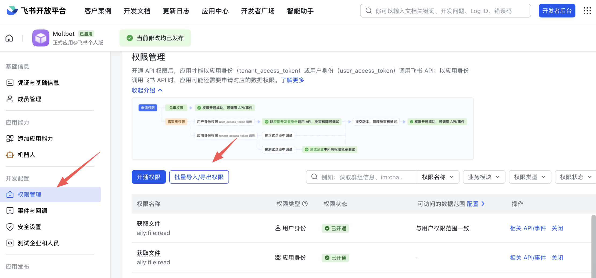

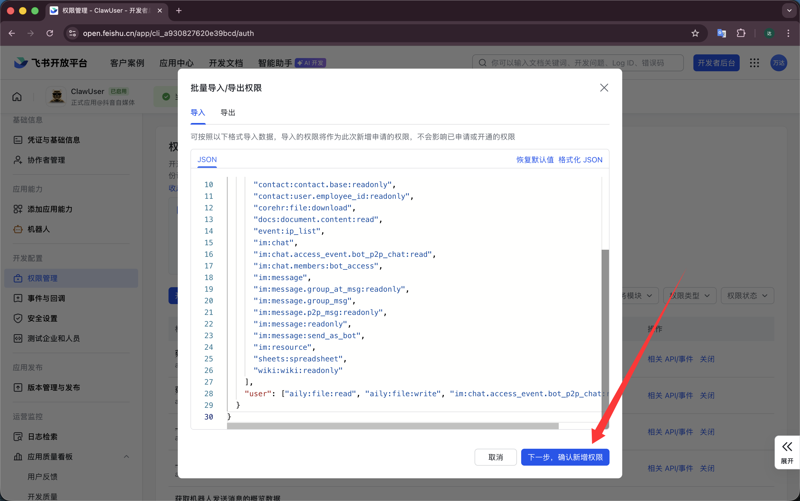

- 启用机器人能力

在 应用能力 > 机器人 页面：

  1. 开启机器人能力
  2. 配置机器人名称

  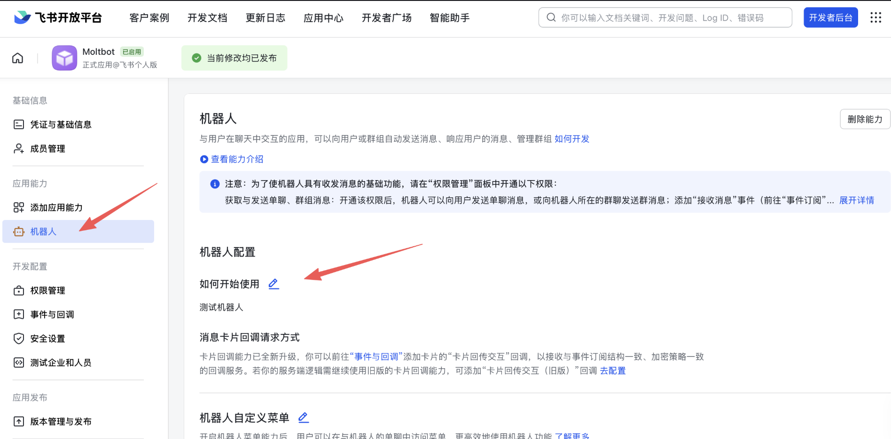

- 配置事件订阅, 添加事件：im.message.receive_v1（接收消息）

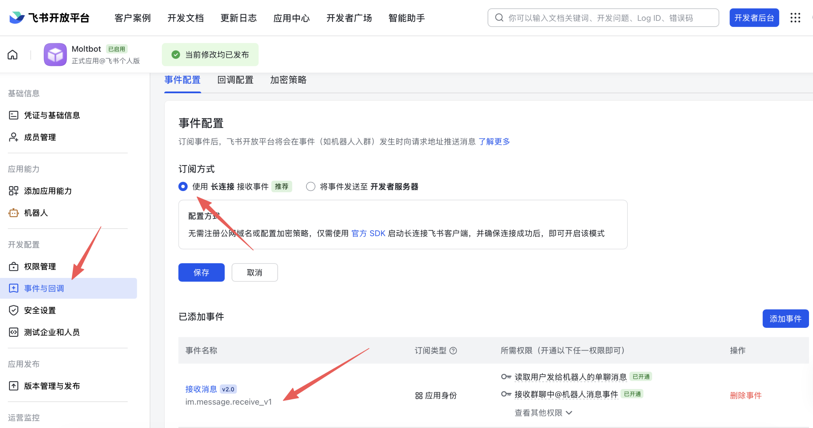

- 发布应用
 1. 在 版本管理与发布 页面创建版本
 2. 提交审核并发布
 3. 等待管理员审批（企业自建应用通常自动通过）

 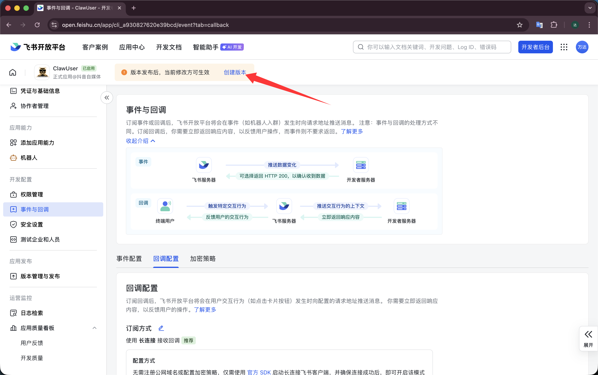

 - 飞书聊天机器人发送 DM 配对

 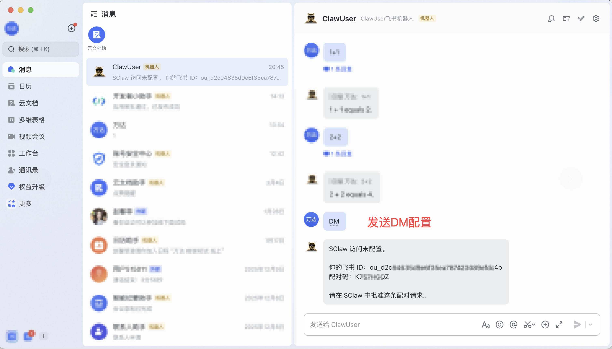

 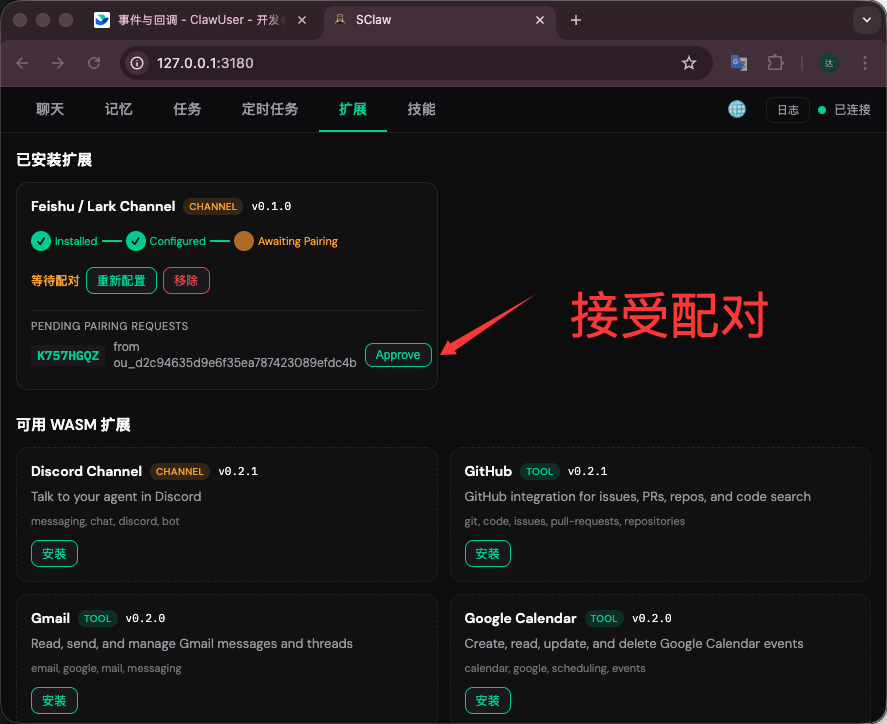

 - 最后就可以和飞书机器人进行加密对话了
