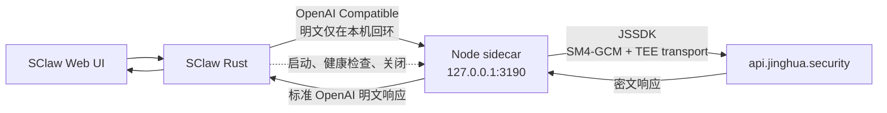

# 密态 SClaw 加解密方案

> 状态：V1 已完成非流式纯文本与标准 function-tool 密态闭环；源码态自动化已验证，当前源码的签名/公证 DMG 证据见验收记录。更新日期：2026-07-15。

## V1 工具调用增量（优先于下文旧 MVP 限制）

本文后半部保留了第一天纯文本 MVP 的执行记录；其中“删除 `tools`”、“拒绝 tool 历史”等陈述只描述旧基线。当前 V1 以本节为准：

- 链路：`SClaw Agent → 127.0.0.1 Sidecar 加密 → SaaS → Gateway → TEE/vLLM → 加密 tool_calls → Sidecar 解密 → SClaw 审批并本地执行 → 加密 tool result 续轮`。
- `tools` 非空即启用；`tool_choice` 默认 `auto`，支持 `none` / `required` / 指定函数。函数名和 JSON Schema 明文透传，assistant `function.arguments` 与 `tool` 结果始终是密文。
- 支持纯文本结束、单/并行 tool-only 和混合正文 + tool calls。SClaw 保留现有工具权限、审批、本地执行和错误回传语义。
- 工具调用仅支持 `POST /v1/chat/completions` 非流式纯文本组合；不与附件、图片、语音、RAG 或 Web Search 混用。
- 无 `tools` 请求继续走旧链路，Sidecar 和 SaaS 不添加 `tools` / `tool_choice`。SaaS 全局开关 `OPEN_API_TOOL_CALLING_ENABLED` 默认关闭。
- 日志只记录 `tools_enabled`、工具/调用数、`finish_reason` 和稳定错误码；不记录 schema、参数、结果或完整密文。

## 1. 文档目标

本文用于指导 Codex 在一个工作日内完成 SClaw 对接荆华 SaaS 密态聊天的最小闭环。

目标不是在一天内完成全部生产能力，而是交付一个可以验证以下链路的 MVP：

1. SClaw 继续使用现有 OpenAI Compatible Provider。
2. SClaw 启动时拉起本地 Node.js sidecar。
3. SClaw 将标准 OpenAI 非流式文本请求发送给本地 sidecar。
4. sidecar 使用现有 JSSDK 完成本地加密、TEE transport 构造和响应解密。
5. sidecar 使用用户自己的 SaaS API Key 调用 `https://api.jinghua.security`。
6. SClaw 退出或异常终止后，Node sidecar 不残留。
7. `SClaw.dmg` 内包含 Node runtime、sidecar 和 JSSDK；目标 Mac 不需要安装 Node、npm、pnpm、Rust 或 Homebrew。

本文同时作为实施任务拆分、验收清单和后续增强路线图。

---

## 2. 一天 MVP 的结论

### 2.1 推荐方案

采用以下结构：



### 2.2 最小改动原则

第一天不新增 Rust LLM Provider，不在 Rust 中重写 SM2、SM3、SM4，也不修改 SaaS。

SClaw 已经具备 OpenAI Compatible Provider，因此 MVP 只需要：

- 新增一个 `jinghua_saas` Provider 配置，Base URL 指向本机 sidecar。
- 新增 Node sidecar，将 SClaw 的 OpenAI 请求转换为 SaaS 密态请求。
- 新增一个很薄的 Rust sidecar 进程管理器。
- 扩展 macOS 打包脚本，把 Node 和 sidecar 一起装入 App。

### 2.3 第一天明确不做（历史 MVP 记录）

以下条目描述最初纯文本 MVP 的范围；其中原生 Tool Calling 与上游改造已经由本文开头的 V1 增量完成。

- 不支持流式输出。
- 不支持附件、图片、语音、RAG 和 Web Search。
- 不支持原生 OpenAI Tool Calling。
- 不保证已有工具调用历史可以继续对话。
- 不做多 Provider 动态切换。
- 不把 SaaS API Key 固化进 DMG。
- 不做本地聊天历史加密。
- 不修改 SaaS DTO、鉴权、数据库或上游 Gateway。
- 不发布正式版本、不提交或推送代码，除非用户另行明确要求。

只要非流式纯文本问答、进程生命周期和零 Node 依赖 DMG 跑通，就视为一天 MVP 完成。

---

## 3. 关键假设与边界

### 3.1 API Key 边界

用户必须使用自己的 SaaS API Key，并通过 SClaw 首次配置流程保存到现有加密 Secret Store。

禁止把 API Key 写入：

- Git 仓库；
- `.env` 示例；
- Node 源码或 bundle；
- `SClaw.app` / DMG；
- 命令行参数；
- 日志、测试快照和错误响应。

已经在聊天、日志或其他非受控位置暴露过的 API Key 必须先停用并重新生成。实施和测试只能使用新 Key。

MVP 中 SClaw 现有 Provider 会把 `Authorization: Bearer <API Key>` 发送到 `127.0.0.1`。Node sidecar 原样转发该 Authorization Header 给 SaaS，不额外持久化 API Key。

### 3.2 加密边界

本方案保护的是：

- Node sidecar 到 SaaS/密态推理链路的请求内容；
- SaaS 返回到 Node sidecar 的响应内容；
- TEE transport 中的 DEK 包装和密态推理输入。

以下位置仍会出现明文：

- SClaw Web UI；
- SClaw Rust 进程内存；
- Node sidecar 进程内存；
- SClaw 本地聊天历史数据库。

因此本方案不能表述为“端到端设备全盘密文”，应表述为“SClaw 到密态推理服务的密态传输与推理”。

### 3.3 DEK 策略

MVP 使用 JSSDK 在 Node sidecar 进程内生成的运行态 DEK：

- sidecar 启动后初始化一次 SDK；
- 同一 sidecar 生命周期内复用同一 DEK；
- sidecar 重启后允许生成新 DEK；
- 每次请求把当前 DEK 通过 `generation_transport.encrypted_dek` 包装给 TEE；
- 不接 SaaS 用户 JWT，不调用云端 DEK 管理接口；
- 不在磁盘保存 `dekHex`。

SClaw 每轮会重新发送上下文，因此旧明文历史可以使用当前 DEK 重新加密后发送。第一天不解决跨客户端密文历史共享问题。

### 3.4 系统和架构边界

当前 macOS release 流程只支持 arm64。MVP 也只保证 Apple Silicon。

为保证一天内可以闭环，当前验证基线暂定为：

- Apple Silicon；
- macOS 13.5 或更高版本；
- Node.js v24.14.0 arm64；
- JSSDK 1.0.15。

这是 MVP 测试基线，不代表最终发行版必须放弃 macOS 12。若正式发行仍要支持 macOS 12，应在发布前替换为兼容该系统的受控 Node runtime，并重新完成全部 DMG 验收。

Node runtime 的最低 macOS 版本必须与 `assets/SClaw.app/Contents/Info.plist` 中的 `LSMinimumSystemVersion` 一致。不能直接把开发机上的 Node 二进制复制进 App 后就发布；必须检查它的 `LC_BUILD_VERSION/minos`。

---

## 4. MVP 请求协议

### 4.1 本地 sidecar API

监听地址固定为：

```text
http://127.0.0.1:3190
```

MVP 只开放：

```text
GET  /health
GET  /v1/models
POST /v1/chat/completions
```

必须绑定 `127.0.0.1`，禁止绑定 `0.0.0.0` 或局域网地址。

### `GET /health`

不返回任何密钥或内部路径，只返回：

```json
{
  "status": "ok",
  "sdkVersion": "1.0.15",
  "upstream": "https://api.jinghua.security"
}
```

### `GET /v1/models`

原样转发 Authorization Header 到：

```text
GET https://api.jinghua.security/v1/models
```

MVP 可以直接透传状态码和 JSON 响应，不增加缓存。

### `POST /v1/chat/completions`

只接受以下能力：

- `stream` 缺省或为 `false`；
- 至少包含一条 `user` 消息；
- 文本内容为 string，或只包含 text block 的数组；
- role 仅支持 `system`、`user`、`assistant`；
- 本轮历史中不能出现真正的 `tool` role 或 assistant `tool_calls` 历史。

SClaw 当前在有工具可用时可能仍会发送顶层 `tools` 和 `tool_choice`。MVP sidecar 应删除这两个顶层字段，使普通文本聊天可以完成；但不尝试执行工具。

如果历史已经包含 `tool` role 或 assistant `tool_calls`，应返回明确错误，而不是静默破坏历史：

```json
{
  "error": {
    "type": "jinghua_bridge_error",
    "code": "SCLAW_TOOL_HISTORY_UNSUPPORTED",
    "message": "MVP 暂不支持工具调用历史，请开始一个新的纯文本会话"
  }
}
```

如果 `stream=true`，返回 HTTP 400 和 `SCLAW_STREAM_UNSUPPORTED`。

### 4.2 入站 OpenAI 请求转换

sidecar 按顺序执行：

1. 校验 Bearer API Key 存在，但不打印其值。
2. 校验请求体和 MVP 能力边界。
3. 把每条消息提取为纯文本。
4. 对每条非空文本调用 `sdk.encryptText()`。
5. 转成 SaaS 要求的密文内容数组。
6. 找到最后一条 user 消息的密文，作为当前 `encryptedUserData`。
7. 调用 `sdk.buildGenerationTransport()`。
8. 映射生成参数。
9. 强制设置 `stream: false`。
10. POST 到 SaaS `/v1/chat/completions`。

转换后的 SaaS 请求示例：

```json
{
  "model": "nvidia/Kimi-K2.6-NVFP4",
  "messages": [
    {
      "role": "system",
      "content": [
        { "type": "text", "text": "<system_ciphertext>" }
      ]
    },
    {
      "role": "user",
      "content": [
        { "type": "text", "text": "<current_user_ciphertext>" }
      ]
    }
  ],
  "temperature": 0.7,
  "max_new_tokens": 2048,
  "stream": false,
  "include_reasoning": false,
  "enable_web_search": false,
  "generation_transport": {
    "function": "Encryption_Generation",
    "encrypted_dek": "<wrapped_dek>",
    "encrypted_dek_len": 168,
    "encrypted_timestamp": "<ciphertext>",
    "encrypted_timestamp_len": 72,
    "encrypted_system_data": "",
    "encrypted_system_data_len": 0,
    "encrypted_user_data": "<current_user_ciphertext>",
    "encrypted_user_data_len": 72,
    "session_id": "<SClaw thread UUID>"
  }
}
```

参数映射：

| SClaw/OpenAI 入参 | SaaS 入参 | MVP 规则 |
|---|---|---|
| `model` | `model` | 原样传递 |
| SClaw request metadata `thread_id` | `generation_transport.session_id` | 仅 `jinghua_saas` Provider 映射；必须为非空稳定会话 ID |
| `messages` | `messages` | 逐条文本加密并改成 content array |
| `temperature` | `temperature` | 有值才传 |
| `top_p` | `top_p` | 有值才传 |
| `max_tokens` | `max_new_tokens` | 改名；限制到 1～32768 |
| `stop` string | `stop` | 原样传递 |
| `stop` array | `stop` | MVP 只取第一个非空字符串 |
| `presence_penalty` | `presence_penalty` | 有值才传 |
| `frequency_penalty` | `frequency_penalty` | 有值才传 |
| `stream` | `stream` | 仅允许 false |
| `tools` | 无 | 删除，MVP 不执行工具 |
| `tool_choice` | 无 | 删除 |
| 其他未知字段 | 无 | 不转发 |

不要把整个入站请求对象 spread 到 SaaS 请求中，避免 SaaS 的严格 DTO 因未知字段返回 400。

### 4.3 SaaS 响应转换

SaaS 非流式返回的 assistant content 是密文数组。sidecar 必须：

1. 读取 `choices[0].message.content`。
2. 对每个 `{ type: "text", text: "<cipher>" }` 调用 `sdk.decryptText()`。
3. 按顺序用换行拼接明文块。
4. 返回标准 OpenAI 字符串 content。
5. 保留 `id`、`object`、`created`、`model`、`finish_reason` 和 `usage`。
6. MVP 忽略加密 reasoning 和 web search sources。

返回给 SClaw 的示例：

```json
{
  "id": "chatcmpl_xxx",
  "object": "chat.completion",
  "created": 1780000000,
  "model": "nvidia/Kimi-K2.6-NVFP4",
  "choices": [
    {
      "index": 0,
      "message": {
        "role": "assistant",
        "content": "解密后的回答"
      },
      "finish_reason": "stop"
    }
  ],
  "usage": {
    "prompt_tokens": 10,
    "completion_tokens": 20,
    "total_tokens": 30
  }
}
```

---

## 5. 目录和文件规划

### 5.1 新增文件

```text
sidecar/
  package.json
  src/
    protocol.mjs
    server.mjs
  test/
    protocol.test.mjs
    server.test.mjs
  vendor/
    client-tssdk/
      VERSION
      SHA256SUMS
      index.js
      chunk-*.js

src/
  sidecar.rs

scripts/
  sync-jssdk-runtime.sh
```

职责说明：

- `sidecar/src/protocol.mjs`：纯函数，负责请求/响应结构转换，不启动 HTTP 服务。
- `sidecar/src/server.mjs`：Node 内置 `node:http` 服务、SDK 初始化、SaaS fetch、健康检查和退出处理。
- `sidecar/test/*.test.mjs`：使用 Node 内置 test runner，不依赖真实 API Key。
- `sidecar/vendor/client-tssdk`：固定版本的 SDK ESM runtime JS，不包含 source map、声明文件或测试文件。
- `src/sidecar.rs`：定位 Node/runtime 文件、启动子进程、读取 ready、健康检查和关闭子进程。
- `scripts/sync-jssdk-runtime.sh`：从指定的 SaaS SDK dist 同步 runtime JS，并生成版本和 SHA256 清单。

### 5.2 修改文件

```text
providers.json
src/lib.rs
src/main.rs
scripts/package-macos-dmg.sh
README.md
FEATURE_PARITY.md
```

实施前后都必须检查 `FEATURE_PARITY.md`。该功能会改变 Provider 和 macOS App 行为，完成后至少需要在对应 Provider/macOS 打包条目中记录 `jinghua_saas` sidecar 的 MVP 状态和能力限制。

---

## 6. Node sidecar 设计

### 6.1 依赖策略

目标 Mac 不运行 `npm install`。

MVP 使用：

- 固定版本 Node runtime；
- Node 内置 `node:http`、`node:crypto`、`node:test`；
- vendored JSSDK ESM runtime；
- Node 自带 `fetch`、WebCrypto、TextEncoder、TextDecoder、AbortController。

不引入 Express、Fastify、axios、dotenv、pm2 等依赖。

`package.json` 只负责本地测试脚本和 Node 版本声明，不应增加运行时 npm 依赖。

### 6.2 SDK 固定和同步

第一天固定当前验证过的 JSSDK 版本 `1.0.15`。

同步脚本输入：

```text
JHMS_SDK_DIST=/absolute/path/to/SaaS/tssdk/client_tssdk/dist
```

同步规则：

- 只复制顶层 `*.js` runtime 文件；
- 删除旧 vendor runtime 后再同步，防止遗留无用 chunk；
- 写入 `VERSION`；
- 写入 `SHA256SUMS`；
- 禁止复制 `.map`、`.d.ts`、测试和源码；
- 同步完成后必须在 Node 中成功 import `index.js`。

生产构建不得依赖开发机上恰好存在 `/Users/wanda/Mac/Workspace/SaaS`。JSSDK runtime 必须已经在 SClaw 仓库或构建制品中固定下来。

外部分发前补做 JSSDK 及其 vendored 依赖的许可证清单检查。

### 6.3 SDK 生命周期

`server.mjs` 只创建一个 `ClientTSSDK`：

```js
const sdk = new ClientTSSDK({
  appName: "sclaw-node-sidecar",
  apiBaseUrl: "https://api.jinghua.security",
});

await sdk.init();
await sdk.envInit();
```

只有 SDK 初始化和 TEE 验证成功后才能开始监听端口并输出 ready。

进程退出前调用 `sdk.destroy()`。

### 6.4 HTTP 服务要求

- 仅使用 Node 内置 HTTP server。
- 请求体大小上限建议 2 MiB；超过返回 413。
- Content-Type 必须是 JSON。
- Authorization 缺失返回 401。
- 无效 JSON 返回 400。
- upstream timeout MVP 设置 120 秒。
- 不记录请求和响应正文。
- 日志只允许记录 request id、状态码、耗时、模型名和错误码。
- 任何日志字段命中 `authorization`、`api_key`、`dek`、`encrypted_dek`、`content` 时必须删除或打码。

### 6.5 Ready 和退出协议

Node 初始化完成后向 stdout 输出一行：

```text
SCLAW_SIDECAR_READY {"port":3190,"sdkVersion":"1.0.15"}
```

其他日志写 stderr，避免 Rust 把普通日志误识别为 ready。

Node 必须监听：

- `process.stdin` 的 `end` / `close`；
- `SIGTERM`；
- `SIGINT`。

触发退出时：

1. 停止接收新请求；
2. 最多等待现有请求 2 秒；
3. 关闭 HTTP server；
4. 调用 `sdk.destroy()`；
5. 退出进程。

父进程异常死亡后 stdin pipe 会关闭，从而避免 orphan Node 进程。

---

## 7. SClaw 侧设计

### 7.1 Provider 注册

在 `providers.json` 增加：

```json
{
  "id": "jinghua_saas",
  "aliases": ["jinghua", "jhms"],
  "protocol": "open_ai_completions",
  "default_base_url": "http://127.0.0.1:3190/v1",
  "api_key_env": "JINGHUA_API_KEY",
  "api_key_required": true,
  "model_env": "JINGHUA_MODEL",
  "default_model": "nvidia/Kimi-K2.6-NVFP4",
  "description": "Jinghua confidential SaaS through the bundled local encryption sidecar",
  "setup": {
    "kind": "api_key",
    "secret_name": "llm_jinghua_saas_api_key",
    "key_url": "https://console.jinghua.security",
    "display_name": "荆华密态 SaaS",
    "can_list_models": false
  }
}
```

说明：

- 第一天先设置 `can_list_models: false`，避免首次 onboarding 在 sidecar 尚未启动时请求本地 `/v1/models`。
- `default_model` 必须在实施步骤 0 中通过当前 `/v1/models` 验证；如果线上结果已变化，以当前返回的 model id 为准。
- 第一天不改变全局默认 Provider；通过 onboarding 选择或 `LLM_BACKEND=jinghua_saas` 启用，避免影响其他现有用户。

### 7.2 Rust sidecar supervisor

`src/sidecar.rs` 提供一个最小结构：

```text
CryptoSidecar::start() -> CryptoSidecar
CryptoSidecar::shutdown(self)
```

路径查找优先级：

Node executable：

1. `SCLAW_NODE_BINARY`，仅供开发和测试；
2. 从当前可执行文件推导 `../Resources/node/bin/node`；
3. debug build 才允许回退到 PATH 中的 `node`；
4. release build 找不到 bundled Node 必须失败，不允许静默使用用户环境。

sidecar entry：

1. `SCLAW_SIDECAR_ENTRY`，仅供开发和测试；
2. 从当前可执行文件推导 `../Resources/crypto-bridge/server.mjs`；
3. debug build 才允许回退到仓库 `sidecar/src/server.mjs`。

启动要求：

- `stdin/stdout/stderr` 使用 pipe；
- 开启 `kill_on_drop(true)`；
- 最多等待 ready 10 秒；
- ready 后再调用 `/health` 验证一次；
- 端口冲突、SDK 初始化失败、子进程提前退出都返回可读错误；
- 不把环境中的 API Key主动传给子进程；API Key只通过后续本机 HTTP Authorization 到达 sidecar。

关闭要求：

- 主动关闭 child stdin；
- 最多等待 2 秒；
- 超时后强制 kill；
- 等待并回收 child，禁止 zombie；
- shutdown 幂等。

### 7.3 启动时机

推荐顺序：

1. SClaw 完成数据库和 Secret Store 初始化；
2. SClaw 得到最终 `components.config.llm.backend`；
3. 如果 backend 为 `jinghua_saas`，启动 sidecar；
4. sidecar ready 后继续启动 channel 和 Agent；
5. Agent 退出后优先关闭 sidecar，再结束主进程。

现有 OpenAI Provider 的构造不会立即请求远程接口，因此 sidecar 可以在 `AppBuilder::build_all()` 完成后、Agent 开始接收消息前启动。

如果实际测试发现 Provider 构造阶段会探测 endpoint，再把 sidecar 启动点前移到 Config 完成解析后、`build_all()` 之前；不要通过修改全局环境变量动态注入端口。

### 7.4 端口策略

一天 MVP 固定 `127.0.0.1:3190`，减少动态 Base URL 注入代码。

端口被占用时必须明确失败并提示：

```text
Jinghua encryption sidecar could not bind 127.0.0.1:3190
```

动态端口和每次启动随机本地 Token 放到后续生产加固，不进入第一天。

---

## 8. macOS DMG 打包设计

### 8.1 App 目录

目标结构：

```text
SClaw.app/
  Contents/
    MacOS/
      ironclaw
    Resources/
      node/
        bin/
          node
      crypto-bridge/
        server.mjs
        protocol.mjs
        vendor/
          client-tssdk/
            VERSION
            SHA256SUMS
            index.js
            chunk-*.js
```

目标 Mac 只运行 App 内的 Node executable。

### 8.2 打包输入

新增构建变量：

```text
SCLAW_NODE_BINARY=/absolute/path/to/approved/arm64/node
```

打包脚本必须验证：

- Node 文件存在且可执行；
- `file` 输出为 arm64 Mach-O；
- `lipo -archs` 与当前 release 策略一致；
- sidecar entry 和 vendored SDK 存在；
- SDK `VERSION` 是预期版本；
- SHA256 清单校验成功。

### 8.3 签名顺序

正式 release 应按以下顺序签名：

1. 复制 Rust binary、Node binary 和 sidecar 资源。
2. 对 bundled Node executable 单独 codesign。
3. Node 使用 Hardened Runtime 和所需 JIT entitlements。
4. 对外层 `SClaw.app` codesign。
5. `codesign --verify --deep --strict`。
6. 创建 DMG。
7. DMG 签名、公证、staple 和 Gatekeeper 检查。

不能依赖 `codesign --deep` 自动修复嵌套签名。

当前 entitlements 已包含：

```text
com.apple.security.cs.allow-jit
com.apple.security.cs.allow-unsigned-executable-memory
```

实施时需要验证 bundled Node 在 Hardened Runtime 下可以正常执行 WebCrypto 和 V8。

### 8.4 macOS 最低版本

当前 App 声明最低 macOS 12。选择 Node runtime 后执行：

```bash
otool -l "$SCLAW_NODE_BINARY"
```

检查 `LC_BUILD_VERSION` 中的 `minos`。

如果 Node 最低版本高于 macOS 12，必须二选一：

1. 换用兼容 macOS 12 的受控 Node 构建；
2. 同步提高 `LSMinimumSystemVersion` 并在发布说明中明确。

第一天不得忽略这个差异后宣称支持 macOS 12。

---

## 9. 分步实施顺序

所有步骤按顺序执行。每一步结束时先完成验收，未通过不得进入下一步。

## 步骤 0：准备和协议确认

### 目标

确认新 API Key、可用模型、当前 SDK Node 兼容性和干净工作区。

### 操作

1. 检查 `git status --short --branch`。
2. 检查并遵守 `AGENTS.md`。
3. 检查 `FEATURE_PARITY.md` 中 Provider 和 macOS App 条目。
4. 停用已经暴露的旧 API Key，生成新的测试 Key。
5. 新 Key 只放本地 shell 或 SClaw Secret Store，不写文件。
6. 使用新 Key 查询 `/v1/models`，确认当天可用 model id。
7. 使用当前 Node runtime import vendored SDK，跑通 `init/envInit/encrypt/decrypt/buildGenerationTransport` 探针。
8. 记录 Node 版本、SDK 版本和 model id，不记录 Key。

### 验收

- [ ] 工作区变更范围清楚。
- [ ] 新 API Key 可用，旧 Key 已停用。
- [ ] `/v1/models` 返回至少一个可用模型。
- [ ] Node SDK 探针完成加密、解密和 generation transport。
- [ ] `default_model` 使用当前真实 model id。

### 给 Codex 的执行提示词

```text
先执行《密态SClaw加解密方案.md》的步骤 0，只做只读检查和安全准备，不修改功能代码。检查 AGENTS.md、FEATURE_PARITY.md、当前 git 状态、JSSDK 版本和 Node 运行探针。不要使用聊天里暴露过的旧 Key，不要把新 Key 写入文件或日志。输出可用 model id、SDK/Node 版本、探针结果和进入步骤 1 的明确结论。
```

## 步骤 1：实现纯函数协议转换

### 目标

先把 OpenAI 明文请求到 SaaS 密文请求、SaaS 密文响应到 OpenAI 明文响应做成可测试纯函数。

### 操作

1. 新增 `sidecar/package.json`。
2. 固定 JSSDK runtime 到 `sidecar/vendor/client-tssdk`。
3. 新增 `sidecar/src/protocol.mjs`。
4. 所有加密能力通过注入的 SDK 接口调用，不在协议层直接实现密码算法。
5. 新增 Node 单元测试，使用 fake SDK 和 fake upstream response。

### 必测用例

- [ ] string content 正确转成密文 content array。
- [ ] text content array 正确提取和加密。
- [ ] system/user/assistant 顺序不变。
- [ ] `max_tokens` 正确改成 `max_new_tokens`。
- [ ] `tools`、`tool_choice` 不进入 SaaS 请求。
- [ ] `stream=true` 返回能力错误。
- [ ] tool role/tool history 返回能力错误。
- [ ] 最后一条 user 密文用于 generation transport。
- [ ] SaaS 密文 content array 被解密成 OpenAI string content。
- [ ] API Key、明文和 DEK 不进入错误文本。

### 验收命令

```bash
node --test sidecar/test/protocol.test.mjs
```

### 给 Codex 的执行提示词

```text
执行《密态SClaw加解密方案.md》的步骤 1。只实现 sidecar 的 vendored JSSDK、纯函数协议转换和单元测试；不要启动真实 HTTP 服务，不改 Rust，不改打包脚本。严格限制为非流式纯文本，顶层 tools/tool_choice 删除，真实 tool 历史明确报错。使用 Node 内置 test runner，测试通过后检查 diff 和敏感信息。不要提交代码。
```

## 步骤 2：实现 Node HTTP sidecar 并直连 SaaS

### 目标

用 curl 通过本机 sidecar 完成一轮真实密态问答。

### 操作

1. 新增 `sidecar/src/server.mjs`。
2. 注入 `ClientTSSDK`、upstream base URL 和 fetch，便于测试。
3. 实现 `/health`、`/v1/models`、`/v1/chat/completions`。
4. SDK 初始化完成后输出 ready。
5. 实现 stdin EOF、SIGTERM 和 SIGINT 退出。
6. 新增 HTTP 层测试。
7. 使用新 API Key 做一次真实 curl 请求。

### 验收命令

```bash
node --test sidecar/test/*.test.mjs
node sidecar/src/server.mjs
curl http://127.0.0.1:3190/health
```

真实 chat curl 必须从本地安全环境读取 Key，命令、终端录屏和文档中不能出现 Key 明文。

### 验收结果

- [ ] health 返回 SDK 版本。
- [ ] models 透传成功。
- [ ] chat 返回标准 OpenAI string content。
- [ ] SaaS 收到的是 content array 密文和 generation transport。
- [ ] 日志不含 Key、DEK、明文和完整密文。
- [ ] 关闭 stdin 或发送 SIGTERM 后进程退出。

### 给 Codex 的执行提示词

```text
执行《密态SClaw加解密方案.md》的步骤 2。基于步骤 1 的纯函数实现 Node 内置 HTTP sidecar、ready/health 和退出协议，并补 HTTP 测试。随后使用用户在本机安全提供的新 Key 做一轮真实 SaaS 非流式文本请求；不要在任何输出中显示 Key、DEK、请求正文或响应正文。测试失败时定位并修复，只处理 sidecar 范围。不要提交代码。
```

## 步骤 3：接入 SClaw Provider 和进程生命周期

### 目标

让 SClaw 自动启动 sidecar，并用现有 OpenAI Compatible Provider 调用它。

### 操作

1. 在 `providers.json` 增加 `jinghua_saas`。
2. 新增 `src/sidecar.rs` 和对应测试。
3. 在 `src/lib.rs` 导出模块。
4. 在 `src/main.rs` 中按最终 backend 启动 sidecar。
5. ready 和 health 通过后才允许 Agent 接收消息。
6. Agent 退出时关闭 sidecar。
7. 父进程提前退出时依赖 stdin EOF 和 `kill_on_drop` 清理。
8. 只在 backend 为 `jinghua_saas` 时启动，不影响其他 Provider。

### 必测用例

- [ ] 找不到 bundled Node 时 release 返回明确错误。
- [ ] debug 可以通过 `SCLAW_NODE_BINARY` 指定 Node。
- [ ] 10 秒内收不到 ready 会终止 child 并报错。
- [ ] child 提前退出会返回其退出状态，但不泄漏敏感信息。
- [ ] shutdown 后 child 已被 wait/reap。
- [ ] 非 `jinghua_saas` backend 不启动 sidecar。

### 验收命令

```bash
cargo fmt --check
cargo test sidecar
cargo check
```

### 给 Codex 的执行提示词

```text
执行《密态SClaw加解密方案.md》的步骤 3。新增 jinghua_saas Provider 配置和最小 Rust sidecar supervisor，复用现有 OpenAI Compatible Provider，不新增 Rust 加密算法或新 LLM Provider。只在最终 backend 为 jinghua_saas 时启动 sidecar，完成 ready、health、stdin EOF、timeout、kill_on_drop 和 wait/reap。运行定向测试、cargo fmt --check、cargo check；检查 FEATURE_PARITY.md 是否需要同步。不要提交代码。
```

## 步骤 4：SClaw 源码态端到端闭环

### 目标

从 SClaw Web UI 完成一轮真实密态文本聊天。

### 操作

1. 使用 onboarding/Secret Store 配置 `jinghua_saas` 和新 API Key。
2. 启动 SClaw。
3. 确认 gateway 仍为 `127.0.0.1:3180`，sidecar 为 `127.0.0.1:3190`。
4. 发送一个不需要工具的简单问题。
5. 确认 UI 展示解密后的回答。
6. 连续发送第二轮，验证明文历史重新加密后可用。
7. 退出 SClaw，确认 Node 不残留。

### 验收命令

```bash
lsof -nP -iTCP:3180 -sTCP:LISTEN
lsof -nP -iTCP:3190 -sTCP:LISTEN
```

退出后：

```bash
lsof -nP -iTCP:3190 -sTCP:LISTEN
pgrep -af 'crypto-bridge|sidecar/src/server.mjs'
```

### 验收结果

- [x] 第一轮简单聊天成功。
- [x] 第二轮上下文聊天成功。
- [x] Node 只监听 127.0.0.1。
- [x] SClaw 退出后 Node 进程和 3190 监听都消失。
- [x] SClaw 日志和 Node 日志无敏感信息。

### 给 Codex 的执行提示词

```text
执行《密态SClaw加解密方案.md》的步骤 4。不要扩展功能，只验证源码态 SClaw -> 本机 Node/JSSDK -> SaaS 的两轮非流式纯文本聊天。验证 3180/3190 监听地址、日志脱敏和 SClaw 退出后的 Node 清理。若失败，沿请求转换、SDK、SaaS状态、响应解密、进程生命周期逐层定位并修复；不要加入流式或工具调用。不要提交代码。
```

## 步骤 5：DMG 捆绑 Node 和 sidecar

### 目标

生成一个不依赖目标 Mac Node 环境的本地 MVP DMG。

### 操作

1. 扩展 `scripts/package-macos-dmg.sh`。
2. 要求或解析 `SCLAW_NODE_BINARY`。
3. 校验 Node 架构、可执行权限和最低 macOS 版本。
4. 复制 Node、sidecar 和 vendored SDK 到 App Resources。
5. Rust supervisor 只能使用 App 内路径。
6. 本地模式生成未签名 `target/SClaw.dmg`。
7. 如果签名、公证凭据已经准备好，再验证 release 模式；凭据缺失不阻塞功能 MVP，但必须记录为发布阻塞项。

### 验收命令

```bash
cargo build --release
SCLAW_NODE_BINARY=/absolute/path/to/approved/arm64/node \
  bash scripts/package-macos-dmg.sh

find target/SClaw.app/Contents/Resources -maxdepth 5 -type f -print
file target/SClaw.app/Contents/Resources/node/bin/node
target/SClaw.app/Contents/Resources/node/bin/node --version
```

### 零外部 Node 验证

不能只验证开发机 PATH。至少满足一个：

1. 在没有 Node/Homebrew 的新 macOS 用户或干净虚拟机安装测试；
2. 明确记录 sidecar child 的 executable 绝对路径来自 `SClaw.app/Contents/Resources/node/bin/node`，同时使用精简 PATH 启动 App。

### 验收结果

- [x] DMG 内包含 Node 和 sidecar。
- [x] App 使用 bundled Node，不使用 `/usr/local/bin/node` 或 `/opt/homebrew/bin/node`。
- [x] App 内 Node 可以启动 JSSDK。
- [x] 安装后的两轮密态文本聊天成功。
- [x] 退出 App 后 bundled Node 不残留。

### 给 Codex 的执行提示词

```text
执行《密态SClaw加解密方案.md》的步骤 5。扩展现有 macOS 打包脚本，把受控 arm64 Node runtime、sidecar 和 vendored JSSDK 放入 SClaw.app/Contents/Resources。验证架构、权限、SDK清单、bundled 路径和最低 macOS 版本；本地 DMG 必须在没有外部 Node 的条件下完成两轮聊天和退出清理。保留现有签名/公证流程，嵌套 Node 必须先单独签名。不要提交代码。
```

## 步骤 6：回归、文档和最终交付

### 目标

确保变更范围可审查、MVP 状态准确、没有敏感信息或无关改动。

### 操作

1. 运行 sidecar 全部测试。
2. 运行 Rust 定向测试、fmt、check。
3. 检查 `git diff --check`。
4. 搜索可能泄漏的 Key、Authorization、DEK 和测试明文。
5. 更新 `README.md`：启用 Provider、首次配置、MVP限制、Node内置说明。
6. 更新 `FEATURE_PARITY.md`：Provider/macOS App 的实际状态和限制。
7. 记录 DMG 路径、大小、架构、SDK版本和测试机器系统版本。
8. 不自动 commit/push。

### 验收命令

```bash
node --test sidecar/test/*.test.mjs
cargo fmt --check
cargo test sidecar
cargo check
git diff --check
git status --short
```

敏感信息检查应针对本次变更文件，并避免把环境变量值打印到终端。

### 验收结果

- [x] Node sidecar 测试 17/17 通过（含响应 body 读取超时）。
- [x] Rust sidecar 定向测试和 `cargo check` 通过。
- [x] `git diff --check` 通过。
- [x] README、FEATURE_PARITY 和独立验收记录已更新。
- [x] DMG 路径、大小、架构、版本、签名、公证和完整性已记录。
- [x] 本次变更文件已完成脱敏扫描，未发现真实 Key、Bearer 凭据或落盘 DEK。
- [ ] 全仓 `cargo fmt --check`：被当前基线的无关 rustfmt 1.94 差异阻塞，未扩大本次改动范围；详见[验收记录](docs/JINGHUA_CONFIDENTIAL_SIDECAR_ACCEPTANCE.md)。

### 给 Codex 的执行提示词

```text
执行《密态SClaw加解密方案.md》的步骤 6。完成最终回归、敏感信息检查、README 和 FEATURE_PARITY 更新，复核所有 diff 只属于密态 sidecar MVP。输出测试证据、DMG 路径/大小/架构、SDK/Node版本、已知限制和剩余发布阻塞。不要提交或推送，等待用户明确指令。
```

---

## 10. 一天 MVP Definition of Done

只有以下条件全部满足，才能报告“最小闭环完成”：

### 功能

- [x] SClaw 可选择 `jinghua_saas` Provider。
- [x] API Key 由用户配置并进入现有 Secret Store。
- [x] SClaw 自动启动 Node sidecar。
- [x] 第一轮非流式纯文本回答成功。
- [x] 第二轮携带历史的纯文本回答成功。
- [x] sidecar 请求 SaaS 时，messages 已加密。
- [x] sidecar 构造并发送 generation transport。
- [x] SaaS 密文响应在本地解密后返回 SClaw。

### 生命周期

- [x] Node 只监听 `127.0.0.1:3190`。
- [x] sidecar 启动失败时 SClaw 给出可读错误。
- [x] SClaw 正常退出后 Node 不残留。
- [x] SClaw 主进程被 SIGTERM 终止后，bundled Node 与 3190 监听不残留。
- [x] 重启 SClaw 后 sidecar 可以重新初始化并聊天。

### 安全

- [x] DMG、仓库、日志和进程参数中没有真实 API Key。
- [x] 日志没有 DEK、明文消息和完整密文内容。
- [x] sidecar 不监听 LAN。
- [x] Node 不把 API Key 保存到文件。

### 打包

- [x] DMG 内包含受控 Node runtime。
- [x] App 运行时使用 bundled Node。
- [x] 目标环境不需要 Node/npm/pnpm/Homebrew/Rust。
- [x] Node 架构和最低 macOS 版本已核对。
- [x] 本地 DMG 安装后完成两轮聊天。

### 工程质量

- [x] Node 单元测试通过。
- [x] Rust sidecar 定向测试通过。
- [ ] `cargo fmt --check` 被当前仓库基线的无关格式差异阻塞。
- [x] `cargo check` 通过。
- [x] `git diff --check` 通过。
- [x] `README.md` 和 `FEATURE_PARITY.md` 与真实实现一致。

---

## 11. 失败定位顺序

遇到问题时按以下顺序定位，不要同时修改多层：

1. `GET /health` 是否成功。
2. JSSDK `envInit` 是否完成 TEE 证书和 Quote 验证。
3. `/v1/models` 是否能携带当前 API Key 到 SaaS。
4. sidecar 单独 curl chat 是否成功。
5. sidecar 发给 SaaS 的字段名是否符合 DTO。
6. `generation_transport.encrypted_user_data` 是否等于最后一条 user 消息密文。
7. SaaS 返回 content 是否为密文数组。
8. JSSDK 是否能使用当前运行态 DEK 解密响应。
9. sidecar 返回给 SClaw 的 content 是否为 string。
10. SClaw Rig Provider 是否正确解析 response。
11. 最后才检查 Web UI。

常见错误映射：

| 现象 | 优先检查 |
|---|---|
| sidecar 启动超时 | Node 路径、SDK import、证书/Quote网络、ready 输出 |
| SaaS 400 unknown field | 是否把 tools/tool_choice/max_tokens 原样 spread 到 SaaS |
| SaaS 401 | Authorization 是否存在、Key 是否停用；禁止打印 Key |
| 上游提示缺少 transport | 是否调用并发送 buildGenerationTransport |
| 解密失败 | 同一 SDK/DEK 是否完成请求和响应、响应块是否被改写 |
| SClaw 内容为空 | sidecar 是否把 content array 转成 string |
| 退出后 Node 残留 | stdin pipe、EOF handler、wait/reap、kill_on_drop |
| DMG 在新 Mac 启动失败 | Node 架构、minos、嵌套签名、资源相对路径 |

---

## 12. 一天之后的增强路线

以下内容在 MVP 稳定后分开规划，不与第一天混做。

### P1：生产安全和打包

- 动态随机本机端口。
- 除 SaaS API Key 外增加每次启动随机本机 Token。
- 正式签名、公证和干净 Mac 自动化测试。
- Node runtime 来源、SHA256 和 SBOM 固化。
- JSSDK runtime 自动同步和兼容性测试。
- sidecar crash 自动拉起，设置有限重试和熔断。
- macOS SIGTERM、系统注销和关机路径专项验证。

### P2：工具调用（V1 已完成）

- 保留标准 OpenAI `tools`、`tool_choice`、assistant `tool_calls` 与 `tool` role，不再用 system prompt 或文本标签模拟。
- Sidecar 加密 assistant `function.arguments` 和本地工具执行结果；SaaS、Gateway 与 TEE 透传或处理密态协议，Sidecar 只在本机解密模型返回的参数。
- 支持工具名/Schema 校验、`auto` / `none` / `required` / 指定函数、混合正文、并行调用、调用结果关联与异常结果续轮。
- 已建立 Sidecar 两轮 Fake SaaS 工具闭环，以及 SaaS、Gateway、TEE 的协议和日志脱敏测试。
- V1 仍不支持流式工具调用，也不与附件、图片、语音、RAG 或 Web Search 混用。

### P3：流式输出

- 接收 SaaS SSE 密文块。
- 每个密文块独立解密。
- 转换成标准 OpenAI `chat.completion.chunk`。
- 正确处理 `[DONE]`、取消、超时和断线。
- assistant 历史进入下一轮前先解密拼接，再重新加密为完整消息。

### P4：本地数据保护

- SClaw 本地聊天历史加密。
- Keychain 管理本地数据库主密钥。
- 备份、迁移、重置和损坏恢复策略。

### P5：最终去 Node 化评估

只有在以下条件出现时再考虑 Rust SDK：

- Node runtime 体积不可接受；
- 嵌套签名/公证长期不稳定；
- JSSDK Node 兼容性维护成本明显升高；
- 需要更严格的单进程密钥边界；
- 已有成熟、审计过且协议测试完整的 Rust 国密实现。

在此之前，Node sidecar 是交付速度和协议一致性更好的方案。

---

## 13. 最终交付物

一天 MVP 完成后应交付：

```text
1. sidecar Node 源码和测试
2. 固定版本的 JSSDK runtime 与校验清单
3. Rust sidecar supervisor
4. jinghua_saas Provider 配置
5. 更新后的 macOS DMG 打包脚本
6. 本地 SClaw.dmg
7. README 和 FEATURE_PARITY 更新
8. 一份不包含敏感信息的验收记录
```

验收记录至少包含：

- Git commit 基线和最终 diff 范围；
- macOS 版本和 CPU 架构；
- Rust、Node、JSSDK 版本；
- 使用的 model id；
- sidecar health 结果；
- 两轮密态文本聊天结果，正文应打码；
- SClaw 退出后的进程/端口检查；
- DMG 路径、大小、签名/公证状态；
- 未完成项和是否阻塞发布。

---

## 14. 一句话执行原则

第一天只证明：`SClaw 标准非流式文本请求 -> bundled Node/JSSDK 加密 -> SaaS 密态推理 -> Node 解密 -> SClaw 展示`，并确保安装包零外部 Node 依赖、退出后无 sidecar 残留。
